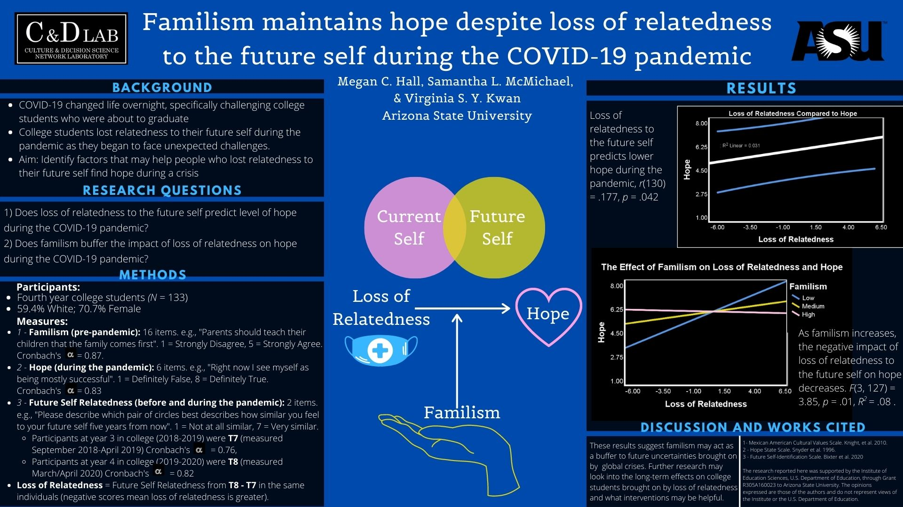

Familism is the sense of responsibility, care, and belonging that people feel toward their families. It has been associated with better overall outcomes for youth. The temporal self and familism have been heavily studied in regards to education and decision-making. However, when the pandemic began, the future became very uncertain, so it was thought that hope, which is heavily associated with better psychological well-being, may deteriorate. This study examined whether familism, which would provide support and a reason to continue to have hope, may allow young adults to remain hopeful in dire circumstances.

For this project, I used data that already existed, and was responsible for analyzing it with IBM SPSS Statistics and Hayes' PROCESS Macro. We hypothesized that:
 
First, loss of relatedness to the future self during COVID-19 (calculated with two timepoints) would predict hope, measured only at the second timepoint.
 
Second, familism would act as a buffer, or would moderate this relationship.

Both hypotheses were found to be correct. Findings were presented at the Society of Social and Personality Psychology 2021. Analyses were not preregistered, but the poster and abstract can be found online through the [Open Science Forum](https://osf.io/nytpu/).
