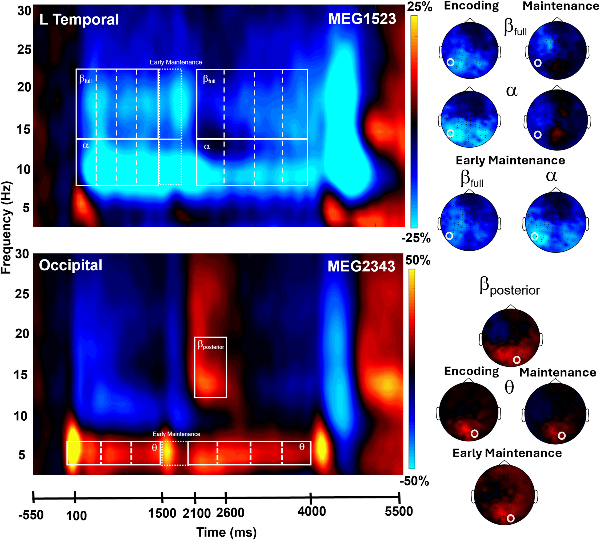

At the [DICoN Lab](https://www.instituteforhumanneuroscience.org/dicon-lab), I work with [magnetoencephalography (MEG)](https://knowingneurons.com/blog/2024/09/24/meg-neurosurgery/) data and neuropsychological assessment information. Typically, I examine tasks related to language, memory, and attention, all of which are interesting to me in the context of aging. My most recent publication for this is on working memory, and I am currently working on a semantic judgement dataset!
