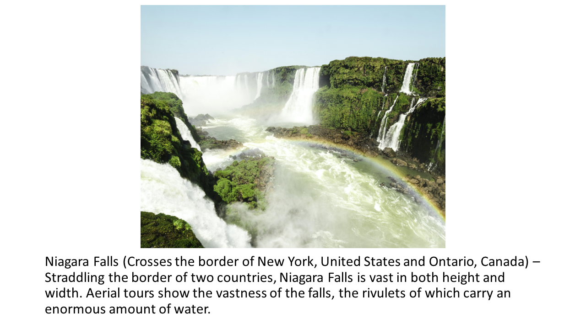

Have you ever marveled at the sight of a beautiful beach, a grand forest, or a deep canyon? Have you been stuck scrolling through social media, stressfully comparing yourself and your accomplishments to that of others around you? I have done both of these things.

For my undergraduate thesis, I wanted to study the effects of nature, when viewed online, on psychological well-being. Specifically, I wanted to know if spending time on social media caused negative effects for psychological well-being, and if so, whether viewing photos of nature could mitigate this effect.

This was important to me because now, youth spend more of their time online, especially on social media. In addition, many people with disabilities or who are elderly cannot go outside, and it is not as though many people are economically able to visit a beautiful forest often as most working adults live in the city. A low-cost intervention that relieves the stress of social media and is accessible through technology would be helpful.

Further, nature has previously been shown to decrease stress and increase attention, but studies are mixed regarding its efficacy online vs. offline. Further, we used awe-inspiring nature photos to see if awe may increase future-self connectedness in this setting.

This project is based in psychology and included preregistration on the [Open Science Forum](https://osf.io/r68aj/) where methods and data are stored and can be requested. The project helped me learn basic scientific writing skills, the process of IRB submissions and online data collection, and a vast amount of research methodology.

We found that, when viewing nature photos versus their own social media feeds, 182 participants recruited on Amazon Mechanical Turk only experienced a statistically significant difference in one out of ten scales when conducting an ANOVA and Tukey's post-hoc test; specifically, for negative affect. Full results can be read as a preprint on [PsyArxiv](https://psyarxiv.com/bfpq6/). Statistical analysis used IBM SPSS 25; R version 3.4.1 was used to make barplots. Reproducible code is stored on [GitHub](https://github.com/PsychNStuff/BriefExpNatSM).

In this project I was able to design, implement, write, and present a study in its entirety.
